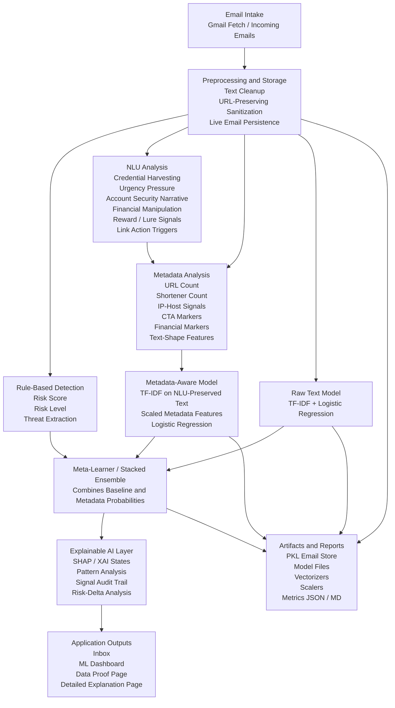

# Project Architecture Aligned to the Phishing Detection System

## 1. Why the Earlier Architecture Was Not Fully Aligned

The earlier architecture image was only partially suitable for this project. It had a few correct ideas such as email intake, NLU analysis, metadata analysis, stacked learning, and explainable AI. However, it did not exactly represent the structure of this phishing detection system.

The main mismatches were:

- the title used a different project identity
- the rule-based phishing layer was missing
- the stacked learner was shown twice
- the metadata model was simplified too much
- live inbox storage and adaptive retraining were not shown
- inbox outputs and project dashboards were not represented accurately

Because of these issues, the earlier diagram could be used only as a conceptual starting point, not as an exact architecture for this project.

## 2. Corrected Architecture for This Project

The architecture below reflects the actual design used in the phishing detection application.

## 3. Explanation of Each Block

### 3.1 Email Intake

This block represents the retrieval of incoming emails from the Gmail-connected account. The project works on live inbox messages rather than only a fixed offline dataset. This is the entry point of the entire pipeline.

### 3.2 Preprocessing and Storage

This block performs preparation of incoming email content before analysis and learning begin. It includes:

- text normalization
- URL-preserving sanitization for NLU
- conversion into learning-ready formats
- persistence of incoming emails into stored files

This block is important because the same email needs to be represented differently for raw ML, metadata analysis, and NLU analysis.

### 3.3 Rule-Based Detection

This is the first scoring layer of the project. It extracts immediate phishing indicators and produces:

- a phishing risk score
- a risk level
- detected threat tokens or patterns

This block is important because it gives fast initial threat screening and also supports fallback detection.

### 3.4 NLU Analysis

This block detects phishing intent patterns from language behavior. It identifies whether the email is attempting to:

- steal credentials
- pressure the user urgently
- simulate account security issues
- request payments
- lure the user with rewards
- trigger suspicious actions

It is not a generic chatbot NLU system. It is a phishing-oriented intent and narrative analysis module.

### 3.5 Metadata Analysis

This block converts the email into structured phishing indicators. Instead of using only plain text, it measures:

- suspicious URL behavior
- link shorteners
- IP-based hosts
- action prompts
- money-related markers
- formatting style and aggression

This representation is one of the main reasons the project improves over text-only methods.

### 3.6 Raw Text Model

This is the baseline machine learning branch. It works on text only and uses TF-IDF features with Logistic Regression. It provides the baseline classification path for comparison against the metadata-aware branch.

### 3.7 Metadata-Aware Model

This model combines:

- TF-IDF on NLU-preserved text
- numeric metadata features
- scaling and sparse fusion

It then applies Logistic Regression for phishing detection. This branch learns from structured phishing evidence that the baseline branch may miss.

### 3.8 Meta-Learner / Stacked Ensemble

This block combines the outputs of the raw-text and metadata-aware branches. Instead of trusting one branch alone, it learns from both probabilities and produces a stronger final phishing decision.

This is the meta-learning-inspired part of the project. It is technically a stacked ensemble rather than classical MAML-style meta-learning.

### 3.9 Explainable AI Layer

This block gives interpretation and proof support. It includes:

- SHAP analysis
- XAI state summaries
- risk-delta comparisons
- feature influence interpretation
- audit-style signal review

This block is important because the project does not only output a label. It also explains why the label was produced.

### 3.10 Application Outputs

This block represents the visible product outputs of the project. These include:

- inbox page with phishing and metadata scores
- ML dashboard with predictions and comparisons
- data proof page with dynamic analytics
- detailed explanation page with simplified interpretation

This is more accurate than showing only one generic dashboard because your project has multiple output surfaces.

### 3.11 Artifacts and Reports

This block shows that the project persists data and learned artifacts over time. It stores:

- incoming emails
- trained models
- vectorizers
- scalers
- metrics reports

This is important because the project works on live incoming data and maintains reusable artifacts.

## 4. Why This Architecture Is Better for the Project

This corrected architecture is more accurate because it shows:

- the live Gmail inbox as the real data source
- the rule-based scoring layer
- the phishing-oriented NLU analysis
- the structured metadata extraction process
- separate raw and metadata learning branches
- stacked ensemble learning
- explainability
- proof and dashboard outputs
- persistence of artifacts

This makes it directly suitable for your report and more defensible during explanation or viva.

## 5. Recommended Report Heading

If you include this in your project record, the best heading would be:

`System Architecture of the Proposed Phishing Detection and Explainable Analysis Framework`

This heading is more accurate than a generic architecture title and fits the actual scope of the project.
