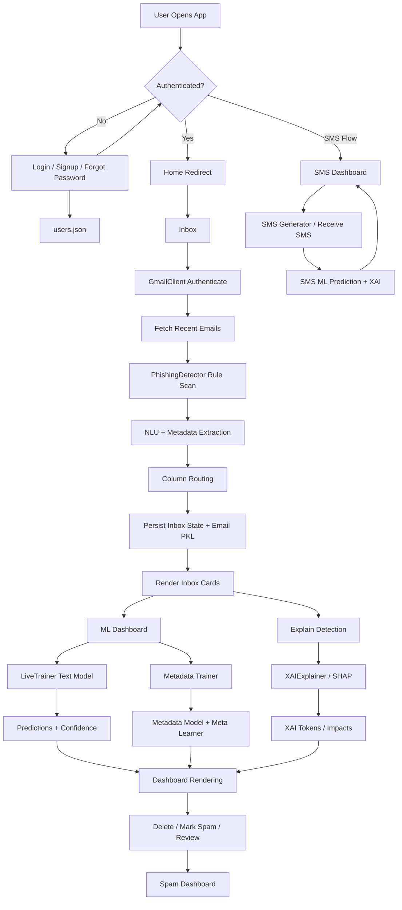
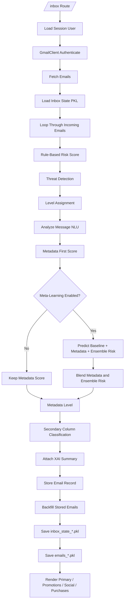
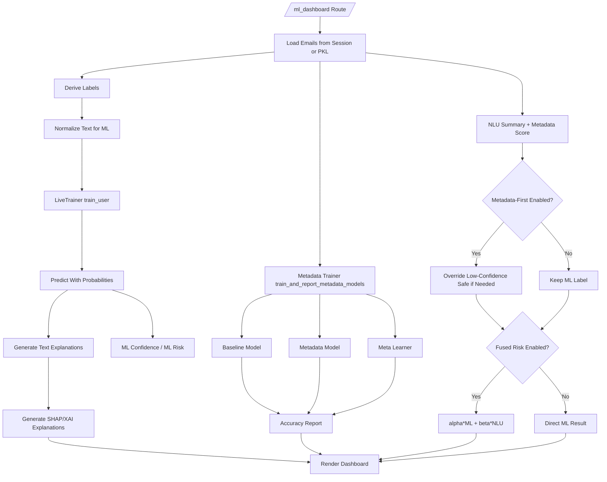
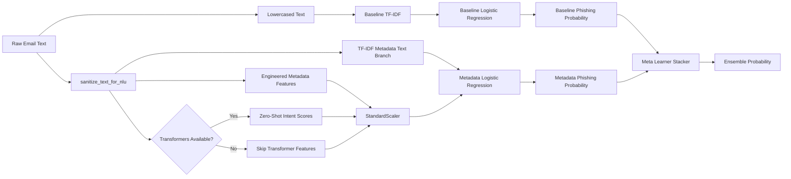

# Project Flowchart

This document gives a high-level flowchart for the phishing detection project, including authentication, inbox ingestion, metadata analysis, ML/XAI processing, SMS handling, and storage artifacts.

## 1. Full System Flow

## 2. Inbox Processing Flow

## 3. ML Dashboard Flow

## 4. Metadata / Meta-Learning Architecture

## 5. Storage / Artifacts Map

```mermaid
flowchart TD
    A[Runtime App] --> B[users.json]
    A --> C[token_*.pkl]
    A --> D[ML_model/emails_*.pkl]
    A --> E[ML_model/inbox_state_*.pkl]
    A --> F[ML_model/spam_*.pkl]
    A --> G[ML_model/sms_incoming.pkl]

    H[LiveTrainer] --> I[ML_model/model_*.pkl]
    H --> J[ML_model/vectorizer_*.pkl]
    H --> K[ML_model/base_model.pkl]
    H --> L[ML_model/base_vectorizer.pkl]

    M[Metadata Trainer] --> N[ML_model/baseline_model_*.pkl]
    M --> O[ML_model/baseline_vectorizer_*.pkl]
    M --> P[ML_model/metadata_model_*.pkl]
    M --> Q[ML_model/metadata_vectorizer_*.pkl]
    M --> R[ML_model/metadata_scaler_*.pkl]
    M --> S[ML_model/meta_learner_model_*.pkl]
    M --> T[ML_model/metadata_feature_config_*.json]
    M --> U[ML_model/metrics_report_*.json]
    M --> V[ML_model/metrics_report_*.md]
```

## 6. Main Components

- `app.py`: central Flask app, routes, inbox flow, ML dashboard flow, deletion, spam handling, SMS endpoints.
- `gmail_client.py`: Gmail OAuth + email fetch.
- `phishing_detector.py`: rule-based phishing scoring and threat extraction.
- `ML_model/live_trainer.py`: text-only ML training and prediction.
- `ML_model/metadata_trainer.py`: metadata model training, reports, and meta-learning ensemble.
- `ML_model/xai_explainer.py`: SHAP/XAI explanations.
- `email_column_router.py`: inbox secondary-column classification.
- `sms_generator.py` and `smsmlmodel.py`: SMS generation and SMS ML pipeline.

## 7. Key Decision Layers

- **Rule Layer**: `PhishingDetector` assigns base score, threats, and level.
- **NLU Layer**: intent-pattern analysis adds risk signals and structured metadata.
- **Metadata Layer**: engineered features + optional transformer intent scores.
- **ML Layer**: text-only classifier from `LiveTrainer`.
- **Meta-Learning Layer**: stacker combines baseline and metadata probabilities.
- **XAI Layer**: SHAP/token explanations for dashboard and explain routes.

## 8. Current Labeling Modes

- `strict_high`: only `High` emails are treated as phishing labels.
- `medium_high`: `Medium` and `High` emails are treated as phishing labels.
- Current live metadata training defaults to `medium_high`.

