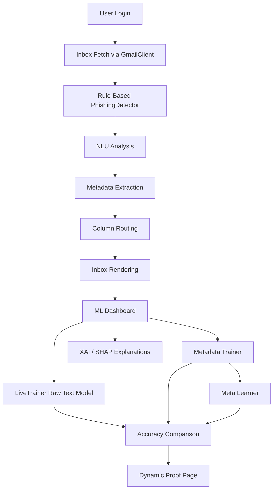
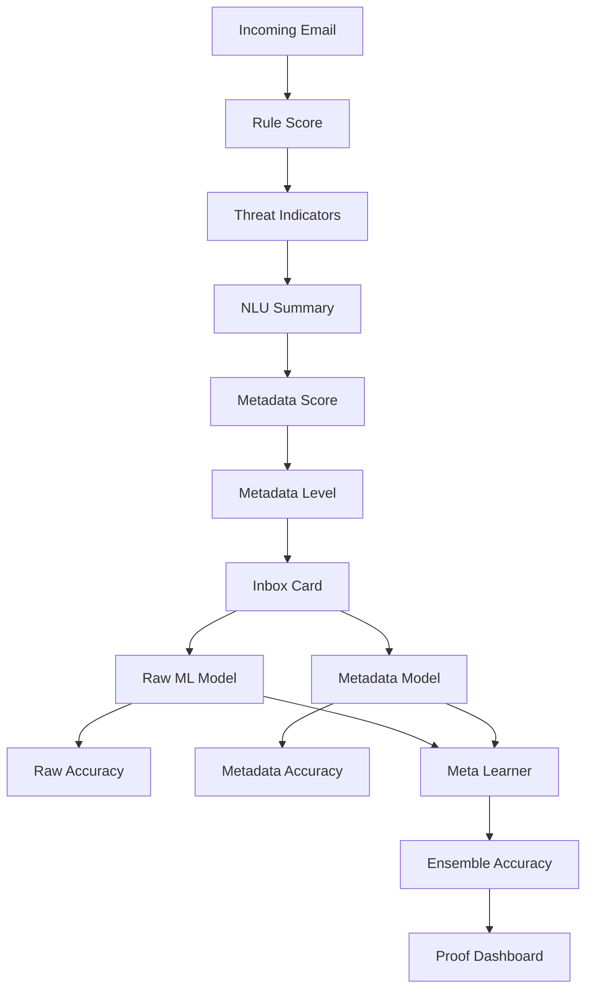

# Project Record Sections After Literature Survey

This document rewrites the report portions that come after the literature survey so they match the current project:

`Sentinel: Dynamic Phishing Detection, Metadata Learning, XAI, and Inbox Security Platform`

Where the sample record format used voice/speaker-recognition headings, the headings below are renamed to fit this phishing detection project. Each renamed heading is explicitly mentioned.

## 3. Existing Systems

### 3.1 Current Existing Systems

In the phishing-detection problem space, many existing systems fall into one of the following categories:

- Static blacklist-based filters that block known malicious domains or URLs.
- Rule-based scanners that depend on fixed keywords such as `verify`, `urgent`, `bank`, and `password`.
- Generic spam filters that are not tuned for phishing intent, credential theft language, or account takeover narratives.
- Email clients that classify inbox tabs such as promotions or social but do not provide explainable phishing-risk analysis for each email.
- ML systems trained only on benchmark datasets and not continuously compared against live inbox data.

In practice, these systems are useful but incomplete. They often fail when phishing emails:

- use paraphrased language instead of known keywords,
- hide risky intent inside normal-looking account or payment notifications,
- contain live URLs and structural cues not fully represented in plain text,
- or evolve faster than static signatures.

### 3.2 Performance Measure

For this project, the existing-system comparison is reinterpreted as:

- raw text-only live-email accuracy,
- metadata-aware live-email accuracy,
- meta-learner accuracy,
- dynamic phishing-risk scoring consistency,
- and explainability coverage.

The current project evaluates performance on both:

- benchmark/base training data, and
- dynamic inbox data actually received through Gmail integration.

### 3.3 Drawbacks of Existing Systems

The main drawbacks that motivated this project are:

- Heavy overdependence on keywords in conventional systems, which this project has significantly reduced through metadata learning, NLU pattern analysis, and meta-learner fusion.
- Weak handling of live inbox distribution shift in earlier systems, which this project has substantially addressed through live-email adaptation, metadata-aware feature extraction, configurable labeling modes, and meta-learner fusion.
- Lack of structured metadata reasoning.
- Poor explainability for end users.
- Inability to compare raw data and metadata-transformed data on the same live sample set.
- Weak support for per-user adaptation.

## 4. Proposed System Design

Note: the source record format used speaker-recognition modules. For this project, those module titles are changed to phishing-detection components.

### 4.1 Block Diagram

Renamed from a generic block diagram to:

`Block Diagram of the Dynamic Phishing Detection Platform`

High-level block flow:



### 4.2 Modules

#### 4.2.1 Gmail Authentication and Email Retrieval

This module authenticates the user using Gmail OAuth and fetches recent inbox emails. It acts as the live data source for the project.

Main responsibilities:

- authenticate the user,
- fetch recent emails,
- normalize basic email structure,
- and pass emails into the phishing-analysis pipeline.

Relevant files:

- `gmail_client.py`
- `app.py`

#### 4.2.2 Rule-Based Risk Assessment

This module calculates an initial phishing score using handcrafted detection rules.

Responsibilities:

- identify threat indicators,
- assign a rule-based score,
- assign a risk level,
- and support early phishing flagging.

Relevant files:

- `phishing_detector.py`
- `app.py`

#### 4.2.3 NLU and Metadata Extraction

This module transforms incoming raw emails into metadata-rich representations.

Responsibilities:

- analyze intent-style phishing patterns,
- preserve raw URL evidence,
- extract structural, financial, stylistic, and behavioral metadata,
- and compute metadata-first risk.

Relevant files:

- `app.py`
- `ML_model/metadata_trainer.py`

#### 4.2.4 Inbox Column Classification

This module routes live inbox emails into:

- Primary,
- Promotions,
- Social,
- Purchases

Responsibilities:

- classify secondary-column membership,
- keep Primary as the full email list,
- and preserve/remove column state dynamically.

Relevant files:

- `email_column_router.py`
- `app.py`
- `templates/inbox.html`

#### 4.2.5 Raw ML Classification

This module trains and predicts using the text-only model.

Responsibilities:

- normalize email text,
- vectorize using TF-IDF,
- train the current live user model,
- predict phishing/safe labels,
- and compute confidence values.

Relevant files:

- `ML_model/live_trainer.py`
- `app.py`

#### 4.2.6 Metadata Model and Meta-Learner

This is the enhanced learning module of the project.

Responsibilities:

- convert live emails into metadata-aware text and engineered features,
- train a baseline text model,
- train a metadata model,
- train a stacked meta learner over both probability branches,
- store reports and sparse-weightage diagnostics.

Relevant files:

- `ML_model/metadata_trainer.py`
- `app.py`

#### 4.2.7 Explainable AI Module

This module provides token-level or feature-level explanations for predictions.

Responsibilities:

- show SHAP/XAI outputs,
- expose explanation APIs,
- render detection reasoning for phishing and safe emails,
- aggregate explainable states across live emails,
- and support graph-based explainable analysis on the proof dashboard.

Relevant files:

- `ML_model/xai_explainer.py`
- `app.py`
- `templates/ml_dashboard.html`
- `templates/data_proof.html`

#### 4.2.8 SMS Security Extension

This module extends the project from email phishing detection to SMS spam/phishing analysis.

Responsibilities:

- generate and receive SMS messages,
- classify SMS using ML,
- show confidence and XAI,
- and store SMS history.

Relevant files:

- `sms_generator.py`
- `smsmlmodel.py`
- `app.py`

### 4.3 Flow Diagram

Renamed to:

`Flow Diagram of the Live Email-to-Decision Pipeline`



### 4.4 Methodology

Renamed from speaker-recognition methodology to:

`Methodology for Live Phishing Detection with Metadata Learning`

**Highlighted core methodology of the project:**

The methodology of this project is one of its strongest contributions because it does not rely on a single static model or a single static dataset. Instead, it uses a layered workflow in which the same incoming live emails are processed through multiple analytical stages, transformed into richer feature spaces, evaluated using more than one model branch, and finally compared through dynamic proof analytics. This makes the methodology more suitable for real inbox conditions than a conventional text-only phishing classifier.

#### 4.4.1 Live Data Preparation and Text Processing

The live dataset is formed from actual inbox emails fetched after user authentication. The project:

- combines subject and content,
- stores inbox emails in PKL state files,
- generates live labels using configured label mode,
- normalizes text differently for raw ML and metadata learning,
- and preserves dynamic inbox evolution.

This stage is important because the project does not work only on benchmark data. It continuously forms a working dataset from the current inbox state of the logged-in user. That means the analysis reflects real incoming data distribution, real message style, and real inbox variation. In report terms, this stage can be highlighted as the bridge between offline dataset learning and practical live deployment.

#### 4.4.2 Metadata Learning and Meta Learning

This project uses a layered learning approach:

- raw text branch using TF-IDF plus logistic regression,
- metadata branch using TF-IDF over NLU-preserved text plus engineered numeric metadata,
- optional transformer intent branch when local transformer support is available,
- stacked meta learner that combines baseline and metadata probabilities.

This design is intended to improve live-data robustness where a single representation is often insufficient.

This section should be highlighted in the report because it explains the central analytical idea of the project:

- the raw-text branch captures linguistic content in the ordinary machine-learning form,
- the metadata branch captures structural and behavioral phishing cues that raw text alone may miss,
- and the meta learner acts as a higher-level decision layer that learns how much to trust each branch.

In other words, the project does not merely add metadata as a side feature. It creates a comparative and complementary learning structure in which each branch contributes different evidence. This is one of the main reasons the project performs better on live inbox data than systems that rely only on static keyword or text classification.

#### 4.4.3 Explainability and Decision Support

Predictions are not treated as black-box outputs. The project also:

- shows token-level explanations,
- shows NLU pattern signals,
- shows metadata scores,
- shows sparse weightage diagnostics,
- and displays proof-oriented charts for raw vs metadata vs ensemble performance.

This explainability stage is another major highlight of the project because it converts model output into understandable evidence. Instead of presenting only a final phishing label, the system shows:

- what language patterns were detected,
- how metadata changed the risk score,
- how the combined learner behaved,
- and how explainable states leaned toward phishing or safe reasoning across the live dataset.

For a report, this strengthens the analytical value of the system because the project is not only predictive, but also interpretable.

## 4.5 Performance Metrics and Measures

The sample record headings such as SDR, SIR, and SAR are audio-specific and are not relevant to this project. They are replaced with phishing-detection metrics that are actually used here.

**Highlighted analysis view of the project:**

The analysis in this project is not limited to one accuracy number. Instead, the project evaluates the behavior of each branch of the system separately and then studies how the branches interact after metadata conversion and model fusion. This multi-layer evaluation is important because live inbox data is noisy, imbalanced, and dynamic. A single score cannot fully explain system quality in such conditions.

### 4.5.1 Raw Text Accuracy

This measures the classification accuracy of the text-only `LiveTrainer` on current live inbox data.

Purpose:

- establishes a baseline on raw incoming emails,
- shows how well a traditional text-only model performs,
- and acts as the reference point for metadata gains.

### 4.5.2 Metadata Accuracy

This measures the performance of metadata-aware risk modeling on the same live inbox emails.

Purpose:

- shows how metadata transformation changes predictive quality,
- measures the effect of URL, CTA, financial, and stylistic features,
- and validates feature engineering on live data.

### 4.5.3 Meta-Learner Accuracy

This measures the accuracy of the stacked ensemble that combines:

- baseline text model probability,
- metadata model probability.

Purpose:

- stabilizes live performance,
- reduces sensitivity to a single branch,
- and provides the strongest decision layer in the current system.

### 4.5.4 Sparse Weightage Analysis

This measures how dense or sparse the learned linear weights are.

Metrics used:

- non-zero weight percentage,
- sparsity percentage,
- L1 norm,
- L2 norm.

Purpose:

- analyze model compactness,
- compare raw and metadata branches,
- and understand how feature usage differs after metadata conversion.

### 4.5.5 Confusion-Matrix Analysis

This analysis shows how each branch behaves in terms of:

- true positives,
- false positives,
- true negatives,
- false negatives.

This is useful because two models may have similar accuracy but very different error patterns. In phishing detection, this distinction matters because missing a phishing email and falsely flagging a safe email do not have the same impact.

### 4.5.6 Risk-Delta Analysis

This analysis measures how the risk score changes:

- from NLU score to metadata score,
- and from metadata score to ensemble score.

This is especially important for this project because it provides direct proof of what changed after feature transformation and branch fusion. It shows not only the final result, but the direction and magnitude of change for each email.

### 4.5.7 Explainable-State Analysis

This analysis aggregates SHAP/XAI states dynamically over the current live inbox and studies:

- how many explanation states lean toward phishing,
- how many explanation states lean toward safe reasoning,
- the average impact strength of those states,
- and the most repeated explanatory tokens.

This gives the report a stronger analytical foundation because it studies explanation behavior at dataset level, not just for one email.

## 4.6 Advantages of the Proposed System

### 4.6.1 Better Live Data Adaptation

The project trains on live inbox emails rather than relying only on static datasets. This makes the system more relevant to real user inbox behavior.

### 4.6.2 Metadata-Aware Threat Detection

The system captures information that text-only pipelines often miss:

- URL structure,
- shorteners,
- IP-host links,
- account-security phrasing,
- and financial-action patterns.

### 4.6.3 Higher Decision Reliability

The meta-learner combines multiple model outputs instead of trusting one classifier. This improves robustness on noisy live data.

### 4.6.4 Explainability and User Trust

Users can inspect:

- pattern hits,
- NLU summaries,
- SHAP explanations,
- metadata-state changes,
- and raw-vs-metadata proof charts.

### 4.6.5 Real-Time and Scalable Modular Design

The project uses a modular architecture, where inbox handling, metadata learning, raw ML, SHAP, and SMS analysis are independent but integrated.

## 4.7 Software Requirements

### 4.7.1 Functional Requirements

The system shall:

- allow user registration and login,
- connect to Gmail and fetch inbox emails,
- analyze emails for phishing risk,
- classify emails into inbox columns,
- render inbox and ML dashboards,
- generate SHAP/XAI explanations,
- support spam movement and deletion,
- support SMS generation and SMS classification,
- generate proof analytics for live data,
- and persist model artifacts and metrics reports.

### 4.7.2 Non-Functional Requirements

The system should:

- remain usable on live inbox data,
- provide understandable explanations,
- persist state safely,
- support modular extension,
- remain responsive for dashboard rendering,
- and keep routes and artifacts organized for reproducibility.

### 4.7.3 Domain Requirements

Because the domain is phishing detection, the system must support:

- email content analysis,
- phishing intent detection,
- URL and link-risk analysis,
- explainability for security decisions,
- and user-centered inbox triage.

## 4.8 Feasibility Study

### Technical Feasibility

The system is technically feasible because it uses:

- Flask for web routing,
- scikit-learn for training and inference,
- SHAP/XAI for explainability,
- Gmail API integration for live inbox data,
- and Chart.js for dynamic visual analytics.

### Operational Feasibility

The project is operationally feasible because:

- users can interact through a standard browser,
- inbox analysis is integrated into the main UI,
- and outputs are understandable through cards, scores, and charts.

### Economic Feasibility

The stack uses open-source libraries and local artifacts, reducing cost compared to fully hosted commercial detection pipelines.

## 5. Datasets, Models, and Algorithms

### 5.1 Dataset and Model

This project uses two types of data:

- base/benchmark data such as the Kaggle phishing dataset,
- dynamic user data fetched live from Gmail inbox storage.

Models used:

- TF-IDF + Logistic Regression for raw text learning,
- TF-IDF + engineered metadata + Logistic Regression for metadata learning,
- stacked Logistic Regression meta learner for branch fusion,
- SHAP/XAI explanations for interpretability,
- optional transformer zero-shot intent scoring when available locally.

### 5.2 Pseudo Code

```text
INPUT: live inbox emails

1. Authenticate user and fetch recent emails
2. For each email:
   a. compute rule-based phishing score
   b. detect threats
   c. compute NLU summary
   d. extract metadata features
   e. compute metadata-first score
   f. store inbox record
3. Train raw text model on current live labels
4. Train metadata model on current live labels
5. Train meta learner using baseline and metadata probabilities
6. Predict raw, metadata, and ensemble decisions
7. Generate SHAP/XAI explanations
8. Render inbox, ML dashboard, and proof dashboard
9. Save reports and model artifacts

OUTPUT: phishing labels, risk scores, explanations, analytics charts
```

## 6. Sample Coding

### 6.1 Backend

The project backend is implemented mainly in:

- `app.py`
- `ML_model/live_trainer.py`
- `ML_model/metadata_trainer.py`
- `ML_model/xai_explainer.py`
- `gmail_client.py`
- `email_column_router.py`

Representative backend logic includes:

- route handling,
- Gmail ingestion,
- metadata extraction,
- training and prediction,
- explanation generation,
- and report generation.

### 6.1.1 Meta-Learning / Metadata Model Code

The original template heading `N-shot learning model code` is renamed here to:

`Metadata Learning and Meta-Learner Code`

This portion corresponds to:

- engineered metadata extraction,
- TF-IDF vectorization over NLU-preserved text,
- metadata model training,
- stacked meta learner training,
- sparse-weightage computation,
- and dynamic metrics report generation.

Relevant file:

- `ML_model/metadata_trainer.py`

### 6.2 Frontend Technologies

Frontend is implemented using:

- HTML templates,
- CSS styling,
- Jinja templating,
- JavaScript,
- Chart.js for analytics graphs.

### 6.2.1 Navbar and Shared UI

The project uses structured navigation across:

- inbox,
- ML dashboard,
- proof dashboard,
- SMS dashboard,
- spam dashboard.

Relevant files:

- `templates/inbox.html`
- `templates/ml_dashboard.html`
- `templates/data_proof.html`

### 6.2.2 Inbox, Dashboard, and Analytics Pages

The original record heading `About, Home and Process pages` is renamed here to:

`Inbox, ML Dashboard, and Proof Analytics Pages`

These pages present:

- live inbox cards,
- NLU and metadata scores,
- SHAP explanations,
- raw-vs-metadata-vs-ensemble graphs,
- confusion-matrix comparison for raw, metadata, and ensemble branches,
- per-email before-and-after transition tables,
- risk-delta histogram views showing score movement after metadata conversion and model fusion,
- explainable-state graphs summarizing how live SHAP/XAI states lean toward phishing or safety,
- methodology explanations,
- a separate plain-language explanation page for report-friendly understanding,
- and proof-oriented analytics.

The newly added explanation page is important for academic reporting because it removes heavy graph dependence and explains the following in simple language:

- what the analysis means,
- how comparisons are made,
- why metadata helps,
- how the project learns from live data,
- what patterns and metadata types are used,
- and how the architecture makes decisions step by step.

## 7. Output

Project outputs include:

- inbox risk cards,
- phishing/safe predictions,
- metadata and NLU scores,
- SHAP/XAI explanations,
- spam dashboard outputs,
- SMS prediction outputs,
- proof dashboard charts,
- confusion-matrix outputs for each decision branch,
- risk-delta visual outputs,
- per-email transition analysis tables,
- explainable-state graph outputs,
- plain-language explanation page content for documentation and presentations,
- metrics report JSON/MD files,
- and persisted model artifacts.

## 8. Testing

### 8.1 Types of Testing

Testing in this project includes:

- route-level validation,
- template rendering validation,
- ML prediction validation,
- report generation validation,
- inbox-state persistence checks,
- dynamic live-data accuracy comparison,
- proof-page graph validation,
- confusion-matrix generation validation,
- per-email transition table validation,
- and explainable-state aggregation validation.

### 8.2 Achieved Performance Metrics

The project currently reports:

- raw text live-data accuracy,
- metadata accuracy,
- meta-learner accuracy,
- branch-wise sparse weightage,
- class-distribution counts,
- dynamic pattern-hit counts,
- confusion-matrix counts for raw, metadata, and ensemble branches,
- risk-delta values after metadata conversion,
- risk-delta values after ensemble fusion,
- explainable-state counts for phishing-oriented and safe-oriented reasoning,
- and average explainable-impact values.

These metrics change as the live inbox dataset changes, which is one of the key strengths of the project.

**Highlighted analytical contribution of the project:**

The achieved metrics are not static benchmark results alone. They are dynamic measurements produced on the currently received inbox emails. This means the project continuously answers three important analytical questions:

- How well does the raw model perform on current live emails?
- How much does metadata conversion improve or alter the decision process?
- How much does the final combined learner improve stability and final decision quality?

This makes the analysis more meaningful for a practical phishing system because the project studies actual operational behavior rather than only offline laboratory performance.

For report presentation, the most recent analytics additions improve interpretability in the following way:

- the confusion matrix shows where each branch is correct or incorrect,
- the risk-delta histogram shows how much score changed after transformation,
- the per-email table shows the movement of each individual email through the pipeline,
- and the explainable-state graph shows how the explanation layer behaves over the full live dataset rather than for a single message only.

These additions should be highlighted in the report as the main analytical evidence of the project because they directly show:

- branch-wise strengths and weaknesses,
- score movement after transformation,
- per-email progression through the pipeline,
- and explanation behavior over the full live dataset.

### 8.3 Test Cases

Representative test cases:

- login with valid and invalid credentials,
- Gmail authentication success/failure,
- inbox fetch with new and stored emails,
- deletion from primary and secondary columns,
- spam marking and unmarking,
- raw text prediction on live emails,
- metadata conversion and metadata score computation,
- proof dashboard generation,
- confusion matrix generation for all branches,
- per-email before/after transition generation,
- risk-delta histogram data generation,
- plain-language explanation page rendering,
- and SHAP explanation route response.

## 9. Conclusion

This project extends beyond a standard phishing detector by integrating:

- live inbox ingestion,
- metadata transformation,
- raw and metadata model comparison,
- stacked meta learning,
- explainability,
- dynamic proof analytics,
- confusion-matrix and delta-based branch analysis,
- and plain-language explanation support for technical and non-technical readers.

The result is a system that not only predicts phishing risk, but also explains how and why that risk was derived on real incoming data.

The most important point to highlight in the conclusion is that the project combines methodology and analysis in a practical way. The methodology is strong because it uses live inbox data, metadata conversion, branch-wise learning, and meta learning. The analysis is strong because it measures not only final accuracy, but also internal state changes, branch-wise confusion, score deltas, sparse weightage, and explanation behavior. This combination gives the project both practical value and report-level analytical depth.

## 10. Future Scope

Future improvements can include:

- transformer-based local intent modeling when dependencies are installed,
- better calibrated live labels,
- domain reputation and URL graph features,
- attachment analysis,
- browser-integrated warning flows,
- user feedback loops for corrective labeling,
- and richer export/report generation for academic and audit use.

## 11. References

Project-relevant references for implementation:

- Flask web framework
- scikit-learn
- SHAP explainability
- Gmail API / OAuth client libraries
- Chart.js
- pandas / numpy / scipy
- project source files in this repository

## 12. User Manual

### 12.1 System Requirements

- Python runtime
- required Python packages from the project environment
- Gmail API credentials for inbox integration
- browser access for dashboards

### 12.2 Installing Dependencies

Install the project dependencies from the current environment or requirements source used in the repository.

Typical categories of dependencies:

- Flask and Werkzeug
- scikit-learn, numpy, pandas, scipy
- SHAP
- Gmail API client libraries
- Chart.js via CDN on frontend pages

### 12.3 Dataset Preparation

Dataset preparation in this project has two forms:

- benchmark/base data for initial training,
- live inbox data stored in `ML_model/emails_*.pkl`.

For metadata learning:

- incoming emails are converted into metadata-aware representations,
- labels are derived using the configured label mode,
- and metrics reports are generated dynamically.

### 12.4 Running the Model

Typical runtime flow:

- start the Flask app,
- login,
- fetch inbox emails,
- open Inbox, ML Dashboard, and Data Proof pages,
- inspect raw, metadata, and ensemble metrics.

### 12.5 Running the Model with a Frontend

The current project frontend is template-based through Flask, not React-based. Therefore the original template heading is renamed to:

`Running the Model Through the Flask Web Interface`

Main user pages:

- `/inbox`
- `/ml_dashboard`
- `/data_proof`
- `/sms_dashboard`
- `/spam_dashboard`

## Heading Renaming Summary

The original sample record appears to be from a voice/speaker project. These headings should be renamed in your report for this project:

- `Speaker Enrolment (Few-Shot Learning Phase)` -> `Gmail Authentication and Email Retrieval`
- `Noisy Input Processing (Recognition Phase)` -> `Rule-Based Risk Assessment`
- `Feature Extraction and Speaker Matching` -> `NLU and Metadata Extraction`
- `Speaker Recognition and Verification` -> `Raw ML Classification`
- `Denoised Voice Reconstruction` -> `Explainable Security Decision Support`
- `Speaker Recognition using Meta-Learning (MAML)` -> `Metadata Learning and Meta Learner`
- `Voice Separation and Enhancement` -> `Live Risk Fusion and Proof Analytics`
- `N-shot learning model code` -> `Metadata Learning and Meta-Learner Code`
- `About, Home and Process pages` -> `Inbox, ML Dashboard, and Proof Analytics Pages`
- `Running the Model with a React.js Frontend` -> `Running the Model Through the Flask Web Interface`
